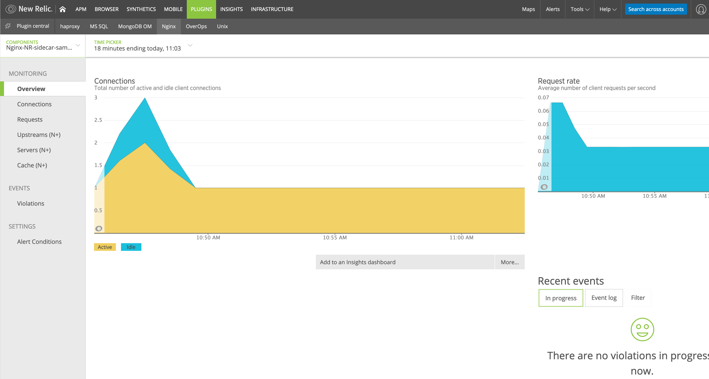

# nginx-nr-sidecar-sample

Sample app demonstrating how to use [sidecar processes](http://v3-apidocs.cloudfoundry.org/version/release-candidate/#sidecars) in Cloud Foundry.

Please note, Sidecar Process is still in **Beta release**. For more information and limitation of sidecar please check [Pivotal documentation](https://docs.pivotal.io/platform/application-service/2-8/devguide/sidecars.html)

## Application
This repository contain a sample page to run on Nginx server and sidecar providing NewRelic monitoring for Nginx container.

You can quickly deploy both apps by targeting your Cloud Foundry api using the `cf cli` and running the respective script.

**NOTE**: Nginx NR [Sidecar script](newrelic-agent-sidecar/nginx-nr-agent.py) is forked copy of [NGINX NR agent](https://github.com/nginxinc/new-relic-agent) updated to work in PCF environment. 

### Before you deploy
    1. NR Environment variables
    Below three environment variables are particularly for NR sidecar. Please make sure these environment variable are set prior to deployment. 
        a) NEWRELIC_LICENSE_KEY: (NR Account license key)
        b) NEWRELIC_APP_NAME: (Application name to appear in NR UI)
        c) NEWRELIC_PLUGIN_LOG_LEVEL: (Sidecar app log level, ERROR by default)
        d) NGINX_HTTP_USER: (Optional in case Nginx status call needs creds)
        e) NGINX_HTTP_PWD: (Optional in case Nginx status call needs creds)

    2. Nginx conf to enable status endpoint
    Update the Nginx config to allow /nginx_stub_status endpoint and limit the access only to localhost.
    
        location /nginx_stub_status {
            stub_status on;
            allow 127.0.0.1;	#only allow requests from localhost
            deny all;		#deny all other hosts	
        }

### Deploying the application
1. CF Login to the foundation you want to deploy this app.
2. In a terminal window, clone the Git repository to your workspace by running git clone.  
3. To create the app:

    If you are using cf CLI v7, run:
    
    `cf7 create-app nginx-nr-sidecar-sample`

    If you are using cf CLI v6, run:

    `cf v3-create-app nginx-nr-sidecar-sample`
4. Open and review the `manifest.yml` file. Under sidecars, the sidecar is specified with a name, process type, and start command. Under env, there is an environment variable that defines the NewRelic license key and other related information. 
5. To apply the manifest to the app:

    If you are using cf CLI v7, run:

    `cf7 apply-manifest`

    If you are using cf CLI v6, run:

    `cf v3-apply-manifest -f manifest.yml`
6. To push the app:

    If you are using cf CLI v7, run:

    `cf7 push nginx-nr-sidecar-sample`

    If you are using cf CLI v6, run:

    `cf v3-push nginx-nr-sidecar-sample`


### View the Processes Running in the Container
To view the app and sidecar process running in the container:
1. SSH into the app container by running:
`cf ssh nginx-nr-sidecar-sample`

2. To see both the `nginx` process for the main app and `nginx-nr-agent` process for the sidecar, run: `ps aux`

The output you see should resemble the output below:
```bash
vcap@996db084-1344-4cc2-7834-b848:~$ ps aux
USER         PID %CPU %MEM    VSZ   RSS TTY      STAT START   TIME COMMAND
vcap          22  0.0  0.0  24468  5488 ?        Ss   17:46   0:00 nginx: master process nginx -p /home/vcap/app -c ./nginx.conf
vcap          29  0.0  0.0  98476 15112 ?        Ss   17:46   0:00 python ./newrelic-agent-sidecar/nginx-nr-agent.py
vcap          96  0.0  0.0  24932  1864 ?        S    17:46   0:00 nginx: worker process
vcap         163  0.0  0.0  70376  3792 pts/0    Ss   17:52   0:00 /bin/bash
```

### Verifying metrics in New Relic
Login to New Relic with and navigate to PLUGINS > Nginx 

